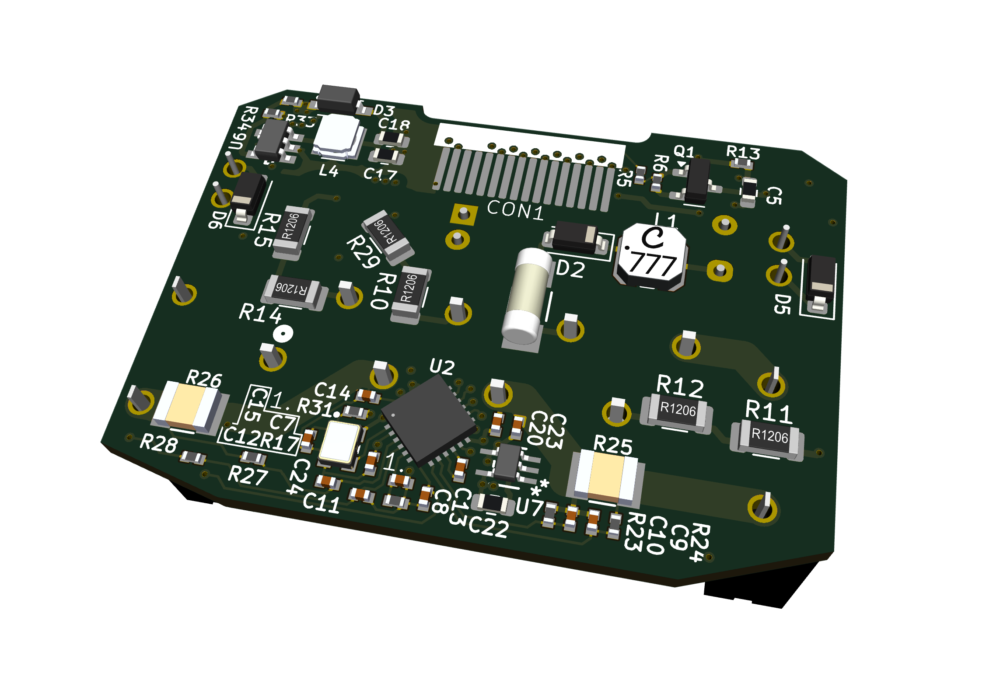
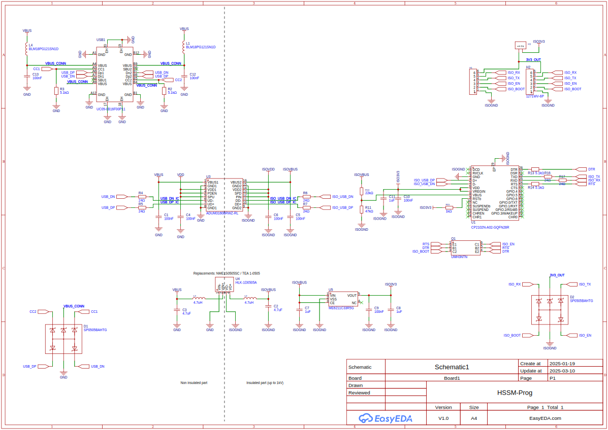

# HSSmartModule

## Overview

This repository contains design files of Home Span Smart Module. The device is intended to use with existing electrical installation as a light controller. Initially intended to be flashed with Home Span firmware and  use with Apple Home Kit ecosystem. This will allow basic support of the implement features like outputs control, reading states form the inputs and control from other devices - aka smart home in-wall module functionality. This will allow rather quick start of the desting of the device in the files and give chance to spot potential problems right away. In the future it is planned to create custom application, with support for all implemented features in hardware like power measurement, input from presence sensor and enabling thread radio communication. The device intentionally is divided into two PCBs. This will allow independent testing, of high voltage and low voltage parts. In the future will be possible to replace low voltage PCB with with another variant - equiped with another MCU, for example NRF52840. In the future after initial bringup, set of boards could be easily redesigned as single rigid-flex PCB. 

## Features

- Powered form 230VAC mains voltage
- 2x output for controlling 230VAC devices, up to 4A per channel
- 3x 230VAC inputs - two intended for ordinary switches for direct control of the outputs, additional input for motion or presence sensor
- Power usage measurement using CS5480
- ESP32-C6 SOC as main MCU and radio module
- 8MB SPI flash memory 
- Wi-Fi 6, Bluetooth 5 LE, Thread (802.15.4), Zigbee
- U.FL antenna connector

## Block diagram

## Low Voltage PCB

### LVPCB Schematic

- 3V3 power input - board is powered from HVPCB, or from programmer. If HVPCB is supplying power, 3V3 power jumper on HSSM-Prog should be left unconnected. 

- ESP32-C6 microcontroller - controlls outputs, reads values from inputs, controlls LEDs and communicate with other devices over thread, zigbee or wifi. All power inputs, crystal oscillator circuit, connection to SPI flash implemented according to datasheet.

- Antenna connector - allow connecting external 2.4 GHz antenna for wirelless connectivity

- SPI flash memory - stores ESP32-C6 program

- Additional switches and outs for debug - as program development with board powered from 230VAC seems risky, added additional switches and LEDs representing inputs and outputs on HVPCB. With those program development is possible, even without HVPCB, while LVPCB beeing powered from 3V3 LDO on programming board. 

- Programming connector - to connect HSSM-Prog, enables UART communication and puting ESP32-C6 into programming mode

- Edge connector - allows HSSM-FCB to be soldered to and connect HVPCB

## High Voltage PCB

<!-- 

 -->

Features:
- Outputs controls - two relays for switching 230VAC loads, internally connected to live wire terminal. Both relays powered from 12V 

- Input switches - three 230VAC inputs - for 

- 230VAC to 12VDC

- 12VDC to 3V3VDC converter

- Power measurement

## Flexible circuit board

## HSSmartModule Programmer

Features
- CP2102N USB UART converter
- Automatically put ESP32 chips into programming mode 
- power supply and data lines insulation 
- 6 poles 1.27 mm header and 6 poles 2.54 mm header for programming
- 3V3 voltage supplied to target MCU can be disable by removal of the jumper

## Manufacturing

All PCBs manufactured by JLCPCB, according to stackup set in each board's project.  

### HSSM-Prog

### HSSM-LVPCB

### HSSM-HVPCB

## Boards bring up 

## HSSM device assembly

### Firmware for boards testing

